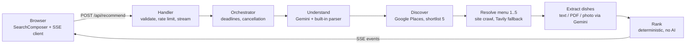

# Forkcast

Forkcast is an AI-assisted restaurant finder for travellers. You describe a meal in a sentence ("vegetarian Italian dinner under €30 in Barcelona"); Forkcast finds real restaurants, reads their actual menus, and recommends the ones that truly fit, showing the dishes, the prices, the evidence, and what it could **not** confirm.

The design rule is that facts are never invented. Every dish, price and dietary reading is traced to a menu document, uncertain readings are labelled as uncertain, and the ranking is deterministic code, not a language model. Barcelona is the only supported city.


## Features

- Natural-language search plus optional filters (meal, diet, cuisine, budget, allergies).
- Live research progress streamed to the browser, with cancel and retry.
- Dish-level matching: vegetarian, vegan, pescatarian, gluten-free, halal/kosher (never confirmable from a menu), avoided foods, allergy warnings.
- Prices only count against a budget when verified in the menu text (or confirmed by a second read of a photo). Disputed, unverified, group-menu and non-EUR prices are never used for a budget claim.
- Three clearly separated result groups: exact matches, closest alternatives (each lists what it misses), and restaurants that need checking. A not-recommended list explains every exclusion.
- Every recommendation shows source links, the quoted menu evidence, and how its score was built.
- Works on desktop and mobile; keyboard and screen-reader friendly.

## Architecture



| Layer | Where |
|---|---|
| UI, event reducer, SSE client | `src/components`, `src/lib/agent` |
| HTTP handler, rate limiter | `src/server/http` |
| Orchestrator (deadlines, metrics) | `src/server/agent/run.ts` |
| Discovery (Places, shortlist) | `src/server/discovery` |
| Menu resolver (find the right menu) | `src/server/menu/resolver` |
| Dish extraction (Gemini, validation) | `src/server/menu/extract` |
| Ranking and explanations | `src/server/ranking` |
| Providers (Places, Tavily, Gemini, safe fetch) | `src/server/providers` |

Phase documents with the reasoning behind each layer are in `docs/` (`phase0-findings`, `phase2-discovery`, `phase3-ui`, `phase4-menu-resolver`, `phase5-menu-extraction`, `phase6-recommendations`, `phase7-integration`, `phase8-final-qa`).

## Tech stack

Next.js 16 (App Router, route handler streaming SSE), React 19, TypeScript, Tailwind CSS 4, zod 4, undici, cheerio, unpdf. Google Places API (New), Tavily, Gemini API. Vitest and Playwright (with axe) for tests. No database, queue or cache server.

## Setup

Requirements: Node 22+, npm, and API keys for Google Places, Gemini and Tavily.

```bash
npm install
cp .env.example .env.local      # fill in the keys
npm run dev                     # http://localhost:3000
```

| Variable | Required | Purpose |
|---|---|---|
| `GOOGLE_PLACES_API_KEY` | yes | restaurant discovery. Without it `/api/recommend` returns 503. |
| `GEMINI_API_KEY` | recommended | sentence understanding, menu reading, photo menus. Without it menus are read with a basic parser and fewer dishes can be confirmed. |
| `TAVILY_API_KEY` | recommended | menu search when a restaurant's own site has no readable menu. |
| `GEMINI_MODEL_CHAIN` | no | comma-separated models tried in order, quota-aware. |
| `GEMINI_PRICE_CHECK_MODEL` | no | cheaper model for the second read of photographed prices. |
| `RATE_LIMIT_MAX_REQUESTS`, `RATE_LIMIT_WINDOW_SEC`, `MAX_CONCURRENT_RUNS` | no | per-client limit (default 6 per 10 minutes, one search at a time) and global concurrent searches (default 4). |
| `TRUST_PROXY_HEADERS` | no | `true` (default) reads the client IP from `x-forwarded-for`; set `false` if there is no proxy. |
| `PLACES_REVIEWS_TO_LLM` | no | keep `false`. |

Keys are read server-side only, are never sent to the browser or logged, and `.env*` files (except `.env.example`) are git-ignored.

## Scripts and tests

| Command | What it does |
|---|---|
| `npm run typecheck`, `npm run lint` | static checks |
| `npm test` | unit, component and integration tests (Vitest). Providers are fakes. |
| `npm run test:e2e` | Playwright on desktop and mobile. Builds and starts the app plus a fake-provider harness. |
| `npm run phase5`, `phase6` | CLIs that run extraction / ranking against real providers |
| `npm run bench -- --text "..." --runs 2` | live end-to-end timing and API-usage benchmark (real providers, uses quota) |
| `npm run audit -- "vegetarian pizza under €25"` | live run that re-fetches every cited menu and checks dishes, prices and labels against the source |

The three layers of tests are kept separate on purpose:

1. **Mocked**: unit/component tests, and Playwright tests that mock `/api/recommend`.
2. **Backend integration with fake providers**: `tests/integration` and the Playwright "real API" tests, which drive the real browser client, handler, orchestrator, resolver, extractor and ranking against deterministic fake Places/Gemini/websites.
3. **Live**: `npm run bench` and `npm run audit` against the real providers. These are manual because they use paid or rate-limited APIs.

Test fixtures are synthetic (see `docs/phase8-final-qa.md`); no Google Places content is stored in the repository tree.

## Production

```bash
npm run build
npm start
```

`GET /api/health` reports which keys are configured (never their values). A search streams for up to about 60 seconds, so the host must allow long streaming responses; the route declares `maxDuration = 120`. Vercel's Fluid compute allows 300 s on the Hobby plan and 800 s on Pro ([limits](https://vercel.com/docs/functions/limitations)); any long-lived Node host (Railway, Fly, Render, a VM) also works. The rate limiter and caches are in process memory, so they apply per instance. A deployment checklist is in `docs/phase7-integration.md`.

## Demo flow (about 3 minutes)

1. Open the app and click the example "Vegetarian tapas in Barcelona under €25", or type `vegetarian Italian dinner under €30`.
2. Watch the research progress: restaurants appear, each menu is found and read in parallel. Press **Cancel search** once to show it stops (the server aborts the run).
3. In the results, open the first card: confirmed dishes with verified prices, the quoted menu label, source links, and **How the score is built**.
4. Scroll to a card marked **Needs checking** to show an uncertain match kept apart from exact ones, and open **Not recommended** to show why restaurants were excluded.
5. Try `vegan lunch under €15`: no exact match, so the closest options each list what they miss, and the budget is never loosened silently.
6. Try `vegan and gluten free dinner, allergic to nuts`: Forkcast refuses to guess and explains that menus rarely state gluten-free, and every card carries an allergy warning.
7. Replay without any API keys: `/?scenario=recorded` (synthetic data) and `/?scenario=recorded-no-exact`.

## Known limitations

- Barcelona only. Gemini output and the Places shortlist vary from run to run.
- Reviews and atmosphere preferences ("quiet", "not too crowded") are not verified.
- Gluten-free is only confirmed by an explicit menu label; halal and kosher cannot be confirmed; allergens can never be confirmed.
- Budgets are checked per dish, not for a whole meal. A restaurant with no prices can never be an exact budget match.
- Menus that exist only as JavaScript viewers or images inside web pages may be unreadable.
- A search takes roughly 15–45 seconds and costs about $0.12–0.17 in provider usage (estimated from assumed list prices). The Gemini free tier allows only a handful of searches per day.
- Rate limiting and caching are per server instance.
